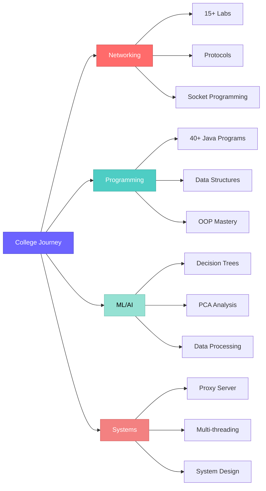

<div align="center">

# 🎓✨ College Work Archive ✨🎓

### *A Journey Through Code, Learning, and Innovation*


[](https://github.com/Guna42/college-work-archive)
[](https://www.python.org/)
[](https://www.java.com/)
[](https://jupyter.org/)
[](https://github.com/Guna42/college-work-archive)

---

### 🌟 *"Code is poetry written for machines, documented for humans"* 🌟

</div>

---

<div align="center">

## 🎯 What's Inside This Treasure Chest?

</div>

<table align="center">
<tr>
<td align="center" width="33%">


### 🌐 **Networking**
Socket Programming  
Client-Server Models  
Protocol Implementations  
**15+ Labs**
</td>
<td align="center" width="33%">


### 💻 **Programming**
Java Mastery Journey  
Data Structures & Algos  
OOP Principles  
**40+ Programs**
</td>
<td align="center" width="33%">


### 🤖 **Machine Learning**
Decision Trees  
PCA Analysis  
Data Processing  
**3+ Projects**
</td>
</tr>
</table>

---

<div align="center">

## 🗺️ Repository Navigation

</div>

```ascii
╔══════════════════════════════════════════════════════════════════════════╗
║                        📂 college-work-archive/                          ║
╠══════════════════════════════════════════════════════════════════════════╣
║                                                                          ║
║  📡 cnn/                    🌐 Networking & Communications               ║
║    ├─ Socket Programming    ├─ Client-Server Models                     ║
║    ├─ CRC & Hamming Codes   ├─ Network Diagnostics                      ║
║    └─ DHCP/DNS Utilities    └─ Wireless Protocols                       ║
║                                                                          ║
║  ☕ java/                    💻 Java Programming Journey                 ║
║    ├─ week1-6/              ├─ Basics → Advanced                        ║
║    ├─ Array Operations      ├─ OOP Concepts                             ║
║    └─ Real Projects         └─ 40+ Programs                             ║
║                                                                          ║
║  🧠 ML/                     🤖 Machine Learning Projects                 ║
║    ├─ Decision Trees        ├─ PCA Analysis                             ║
║    ├─ Data Processing       ├─ Jupyter Notebooks                        ║
║    └─ Datasets & Models     └─ Group Projects                           ║
║                                                                          ║
║  🖥️ os_project/             ⚙️ Multi-Client Proxy Server                ║
║    ├─ Server & Client       ├─ GUI Interface                            ║
║    ├─ Caching System        ├─ Multi-threading                          ║
║    └─ HTTP Handling         └─ Complete Documentation                   ║
║                                                                          ║
║  🎓 Internship/             📜 Professional Materials                    ║
║    ├─ Certificates          ├─ Reports                                  ║
║    └─ Presentations         └─ Weekly Diaries                           ║
║                                                                          ║
╚══════════════════════════════════════════════════════════════════════════╝
```

---

<div align="center">

## 🚀 Featured Projects

</div>

<details open>
<summary><b>🌐 Multi-Client Proxy Server</b> - The Crown Jewel</summary>

<br>

```
┌─────────────────────────────────────────────────────────────┐
│  🎯 A Production-Ready HTTP Proxy Server                    │
├─────────────────────────────────────────────────────────────┤
│                                                             │
│  ✨ Features:                                               │
│     • Multiple simultaneous client connections             │
│     • Intelligent web page caching                         │
│     • Beautiful GUI & CLI interfaces                       │
│     • Complete request/response handling                   │
│     • Threaded architecture for performance                │
│                                                             │
│  📁 Files: server.py | client.py | proxy_client_gui.py     │
│  🎬 Includes: Demo video + Documentation + Presentation    │
│                                                             │
└─────────────────────────────────────────────────────────────┘
```

</details>

<details>
<summary><b>🧠 Machine Learning Suite</b> - Intelligence in Action</summary>

<br>

| Project | Description | Tech Stack |
|---------|-------------|-----------|
| 🌳 **Decision Trees** | Tennis outcome prediction | Jupyter, scikit-learn |
| 📊 **PCA Analysis** | Dimensionality reduction | NumPy, pandas |
| 🎨 **Color Analysis** | Pattern recognition | Python, matplotlib |

</details>

<details>
<summary><b>☕ Java Programming Evolution</b> - From Zero to Hero</summary>

<br>

```
Week 1: Hello World          →  Type Casting & Basics
Week 2: Control Flow         →  If-Else & Loops  
Week 3: Decision Structures  →  Switch & Logic
Week 4: Array Mastery        →  Sorting & Searching
Week 5: OOP Introduction     →  Classes & Objects
Week 6: Advanced Concepts    →  Recursion & Methods
```

**Highlight Projects:** 
- 💳 `ElectricityBill.java` - Billing system
- 🛒 `ShoppingCart.java` - E-commerce logic
- 🚂 `RailwayReservation.java` - Booking system
- 📚 `StudentResults.java` - Grade calculator

</details>

---

<div align="center">

## 📊 Repository Statistics

</div>

<div align="center">

```
┏━━━━━━━━━━━━━━━━━━━━━━━━━━━━━━━━━━━━━━━━━━━━━━━━━━━━━━━━━━┓
┃                  📈 Project Metrics                       ┃
┣━━━━━━━━━━━━━━━━━━━━━━━━━━━━━━━━━━━━━━━━━━━━━━━━━━━━━━━━━━┫
┃                                                           ┃
┃  📁 Total Files:        180+                             ┃
┃  🐍 Python Scripts:     60+                              ┃
┃  ☕ Java Programs:      40+                              ┃
┃  📓 Jupyter Notebooks:  5+                               ┃
┃  📚 Documentation:      10+                              ┃
┃  🎯 Major Projects:     4                                ┃
┃                                                           ┃
┃  💪 Lines of Code:      ~15,000+                         ┃
┃  ⏱️ Hours Invested:     500+                             ┃
┃  🎓 Semesters:          Multiple                         ┃
┃                                                           ┃
┗━━━━━━━━━━━━━━━━━━━━━━━━━━━━━━━━━━━━━━━━━━━━━━━━━━━━━━━━━━┛
```

</div>

---

<div align="center">

## 💡 Skills & Technologies Mastered

</div>

<div align="center">

### **Languages**


### **Networking & Systems**


### **Machine Learning & Data Science**


### **Concepts & Algorithms**


</div>

---

<div align="center">

## 🎮 Quick Start Guide

</div>

<table>
<tr>
<td width="50%">

### 🐍 **Python Projects**

```bash
# 🌐 Network Diagnostics
python cnn/dhcp_check.py
python cnn/dns_check.py
python cnn/wifi.py

# 🖥️ Start Proxy Server
cd os_project
python server.py

# 🧠 ML Notebooks
jupyter notebook ML/play_tennis.ipynb
```

</td>
<td width="50%">

### ☕ **Java Programs**

```bash
# 📚 Week Assignments
javac java/week1/MyInfo.java
java java.week1.MyInfo

# 🔧 Utilities
javac java/week4/MergeArrays.java
java java.week4.MergeArrays

# 🛡️ Error Correction
javac cnn/crc&hamilton/CRC.java
java cnn.crc.CRC
```

</td>
</tr>
</table>

---

<div align="center">

## 🏆 Learning Achievements Unlocked

</div>


---

<div align="center">

## 🎨 Code Quality Standards

</div>

```
┌───────────────────────────────────────────────────────────────┐
│  ✨ This Repository Follows Best Practices                   │
├───────────────────────────────────────────────────────────────┤
│                                                               │
│  ✓ Clean, readable, and well-commented code                  │
│  ✓ Consistent naming conventions throughout                  │
│  ✓ Modular design with separation of concerns                │
│  ✓ Comprehensive documentation for each project              │
│  ✓ Organized folder structure for easy navigation            │
│  ✓ Version control with meaningful commit messages           │
│  ✓ Real-world applications and practical implementations     │
│                                                               │
└───────────────────────────────────────────────────────────────┘
```

---

<div align="center">

## 🌟 Project Highlights

</div>

<div align="center">



</div>

---

<div align="center">

## 📚 Educational Journey Timeline

</div>

```
2025 JUN                                             2026
  │                                                 │
  ├─ Week 1-6: Java Fundamentals ──────────────────┤
  │                                                 │
  ├─ CNN Labs 1-15: Network Programming ───────────┤
  │                                                 │
  ├─ ML Projects: Data Science & AI ───────────────┤
  │                                                 │
  ├─ OS Project: Proxy Server Development ─────────┤
  │                                                 │
  └─ Internship: Professional Experience ──────────┤
                                                    │
                                              Jan 7, 2026
```

---

<div align="center">

## 🎯 Use Cases for This Repository

</div>

<table align="center">
<tr>
<td align="center" width="25%">

### 🎓 **Students**
Reference for learning  
Code examples  
Project templates  
Study material

</td>
<td align="center" width="25%">

### 👨‍💼 **Recruiters**
Skills demonstration  
Code quality showcase  
Project portfolio  
Problem-solving ability

</td>
<td align="center" width="25%">

### 👨‍🏫 **Educators**
Teaching examples  
Assignment ideas  
Lab templates  
Course structure

</td>
<td align="center" width="25%">

### 👨‍💻 **Developers**
Code snippets  
Implementation reference  
Best practices  
Quick solutions

</td>
</tr>
</table>

---

<div align="center">

## 🔥 Popular Files & Projects

</div>

| 🌟 Rating | File/Project | Description | Category |
|:---------:|--------------|-------------|----------|
| ⭐⭐⭐⭐⭐ | `os_project/server.py` | Multi-client proxy server | Systems |
| ⭐⭐⭐⭐⭐ | `ML/play_tennis.ipynb` | Decision tree classifier | ML |
| ⭐⭐⭐⭐⭐ | `cnn/AP23110010744_lab15.py` | Advanced socket programming | Networking |
| ⭐⭐⭐⭐ | `java/week6/` | OOP & recursion examples | Java |
| ⭐⭐⭐⭐ | `cnn/crc&hamilton/` | Error detection algorithms | Algorithms |

---

<div align="center">

## 🎪 Interactive Demo

</div>

<div align="center">

**Want to see these projects in action?**

[](https://github.com/Guna42/college-work-archive)
[](https://github.com/Guna42/college-work-archive)
[](https://github.com/Guna42/college-work-archive)

</div>

---

<div align="center">

## 🤝 Connect & Collaborate

</div>

<div align="center">

**Found this helpful? Let's connect!**

[](https://github.com/Guna42)
[](mailto:AP23110010744@student.edu)
[](https://linkedin.com)

</div>

---

<div align="center">

## 🎁 Special Thanks

</div>

```
╔═══════════════════════════════════════════════════════════════╗
║                                                               ║
║  💙 To all the professors who guided this journey            ║
║  💙 To peers who collaborated and shared knowledge           ║
║  💙 To the open-source community for endless inspiration     ║
║  💙 To coffee, for keeping the code flowing                  ║
║                                                               ║
╚═══════════════════════════════════════════════════════════════╝
```

---

<div align="center">

## 📜 License & Usage

</div>

<div align="center">

```
MIT License - Feel free to use for educational purposes
⚠️ Please provide attribution when using code samples
📚 Academic integrity is important - use as reference, not copy
```

[](https://opensource.org/licenses/MIT)

</div>

---

<div align="center">

## 🎊 Repository Stats

</div>

<div align="center">


</div>

---

<div align="center">

## 💖 Show Your Support

</div>

<div align="center">

**If this repository helped you, consider:**

⭐ **Star this repository**  
🔱 **Fork for your own learning**  
👀 **Watch for updates**  
📢 **Share with fellow students**  
💬 **Open issues for questions**

</div>

---

<div align="center">


### 🚀 *"Every expert was once a beginner. Every master was once a learner."*

**Built with 💙 by Guna | Last Updated: January 7, 2026**

[](https://github.com/Guna42)
[](https://github.com/Guna42)

---

</div>

<div align="center">

**[⬆ Back to Top](#-college-work-archive-)**

</div>
